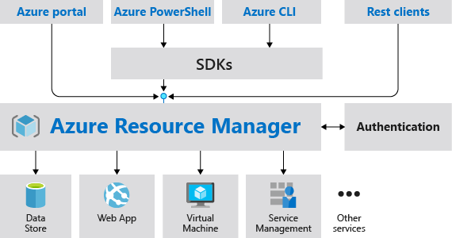
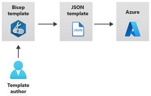

# Prerequisites for Azure administrators

## Use Azure Resource Manager

### Introduction

### Review Azure Resource Manager benefits

* Azure Resource Manager provides a consistent management layer to perform tasks through Azure PowerShell, Azure CLI, Azure portal, REST API, and client SDKs.

* The following image shows how all the tools interact with the same Azure Resource Manager API. The API passes requests to the Azure Resource Manager service, which authenticates and authorizes the requests. Azure Resource Manager then routes the requests to the appropriate resource providers.



### Review Azure resource terminology

* **Resource** - A manageable item that is available through Azure. Some common resources are a virtual machine, storage account, web app, database, and virtual network, but there are many more.
* **Resource group** - A container that holds related resources for an Azure solution. The resource group can include all the resources for the solution, or only those resources that you want to manage as a group. You decide how you want to allocate resources to resource groups based on what makes the most sense for your organization.
    * Resource Groups are at their simplest a logical collection of resources.
* **Resource provider** - A service that supplies the resources you can deploy and manage through Resource Manager. Each resource provider offers operations for working with the resources that are deployed. Some common resource providers are Microsoft.Compute, which supplies the virtual machine resource, Microsoft.Storage, which supplies the storage account resource, and Microsoft.Web, which supplies resources related to web apps.
    * The name of a resource type is in the format: {resource-provider}/{resource-type}.

### Create resource groups

* All the resources in your group should share the same lifecycle. You deploy, update, and delete them together. If one resource, such as a database server, needs to exist on a different deployment cycle it should be in another resource group.
* Each resource can only exist in one resource group.
* A resource group can contain resources that reside in different regions.

### Create Azure Resource Manager locks

* **Read-Only locks**, which prevent any changes to the resource.
* **Delete locks**, which prevent deletion.

### Reorganize Azure resources

* When moving resources, both the source group and the target group are locked during the operation. Write and delete operations are blocked on the resource groups until the move completes. This lock means you can't add, update, or delete resources in the resource groups. Locks don't mean the resources aren't available. For example, if you move a virtual machine to a new resource group, an application can still access the virtual machine.

* Before beginning this process be sure to read the [Move operation](https://learn.microsoft.com/en-us/azure/azure-resource-manager/management/move-resources-overview) support for resources page. This page details what resources can be moved between resources group, subscriptions, and regions.

* The move operation doesn't support moving resources to new Microsoft Entra tenant.

### Remove resources and resource groups

```powershell
Remove-AzResourceGroup -Name "ContosoRG01"
```

### 

## Introduction to Azure Cloud Shell 

### What is Azure Cloud Shell?

* Azure Cloud Shell is a command-line environment you can access through your web browser. You can use this environment to manage Azure resources, including VMs, storage, and networking. Just like you do when using the Azure CLI or Azure PowerShell.

* Because Microsoft manages Cloud Shell, you always have access to the most recent versions of the Azure CLI and PowerShell modules right from any browser.

* Azure Cloud Shell also provides cloud storage to persist files such as SSH keys, scripts, and more.

### How does Azure Cloud Shell work?

### When should you use Azure Cloud Shell?

##  Introduction to Bash 

### What is Bash?

### Bash fundamentals

### Bash commands and operators

## Introduction to PowerShell

### What is PowerShell?

### Exercise - Run your first PowerShell commands

### Locate commands

### Exercise - Locate commands

## Configure resources with Azure Resource Manager templates

### Review Azure Resource Manager template advantages

* An Azure Resource Manager template precisely defines all the Resource Manager resources in a deployment. You can deploy a Resource Manager template into a resource group as a single operation.

### Configure resources with Azure Resource Manager templates

A Resource Manager template can contain sections that are expressed using JSON notation, but aren't related to the JSON language itself:

```json
{
    "$schema": "http://schema.management.​azure.com/schemas/2019-04-01/deploymentTemplate.json#",​
    "contentVersion": "",​
    "parameters": {},​
    "variables": {},​
    "functions": [],​
    "resources": [],​
    "outputs": {}​
}
```

### Explore the Azure Resource Manager template parameters


```json
"parameters": {
    "<parameter-name>" : {
        "type" : "<type-of-parameter-value>",
        "defaultValue": "<default-value-of-parameter>",
        "allowedValues": [ "<array-of-allowed-values>" ],
        "minValue": <minimum-value-for-int>,
        "maxValue": <maximum-value-for-int>,
        "minLength": <minimum-length-for-string-or-array>,
        "maxLength": <maximum-length-for-string-or-array-parameters>,
        "metadata": {
        "description": "<description-of-the parameter>"
        }
    }
}
```

### Consider Bicep Templates

Azure Bicep is a domain-specific language (DSL) that uses declarative syntax to deploy Azure resources. It provides concise syntax, reliable type safety, and support for code reuse.



### Review QuickStart templates

[Azure Quickstart Templates](https://azure.microsoft.com/resources/templates/) are Azure Resource Manager templates provided by the Azure community.

### Interactive lab simulation - templates


## Deploy to multiple Azure environments by using JSON ARM template features

### Add flexibility to your Azure Resource Manager template by using template functions

* ARM template functions add flexibility to your ARM template by dynamically getting values during deployment. To understand functions, you first need to understand expressions. Expressions are values that are evaluated when the template is deployed. They start and end with brackets [], and can return a string, integer, Boolean, array, or object.

```json
"parameters": {
  "location": {
    "type": "string",
    "defaultValue": "[resourceGroup().location]"
  }
},
```

### Exercise - Use Azure Resource Manager functions to create expressions

### Reuse expressions by using Azure Resource Manager template variables

* An ARM template variable is a construct that holds a value for later use. Variables are best used when a value needs to be specified in several places in a template. Wherever the variable is used in the template, Resource Manager replaces it with the resolved value.

```json
"variables": {
  "storageName": "[concat(toLower(parameters('storageNamePrefix')), uniqueString(resourceGroup().id))]"
},

"resources": [
  {
    "type": "Microsoft.Storage/storageAccounts",
    "name": "[variables('storageName')]",
    ...
  }
]
```

### Exercise - Use Azure Resource Manager variables to store expressions

```json
$templateFile = "azuredeploy.json"
$today=Get-Date -Format "MM-dd-yyyy"
$deploymentName="addVariable-"+"$today"
New-AzResourceGroupDeployment `
  -Name $deploymentName `
  -TemplateFile $templateFile `
  -storagePrefix {your-Prefix}
```

