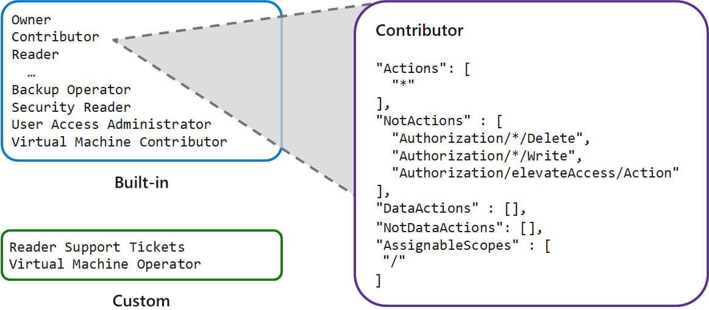

# Manage Azure identities and governance in Azure

## Configure Microsoft Entra ID

### Describe Microsoft Entra ID benefits and features

[alt text](./res/1-manage-azure-identities-and-governance/images/image-0.png)

### Describe Microsoft Entra concepts

| Concept                | Description                                                                                                                                                                      |
|------------------------|----------------------------------------------------------------------------------------------------------------------------------------------------------------------------------|
| Identity               | An object that can be authenticated, including users, applications, or servers. Microsoft Entra ID provides the identity service.                                                |
| Account                | An identity with associated data. Requires a valid identity.                                                                                                                     |
| Microsoft Entra account| An identity created through Microsoft Entra ID or another Microsoft cloud service, stored in Microsoft Entra ID. Also known as a work or school account.                        |
| Azure tenant (directory)| A dedicated instance of Microsoft Entra ID representing a single organization. Created automatically when signing up for a Microsoft cloud service subscription.               |
| Azure subscription     | Used to pay for Azure cloud services. Each subscription is linked to a single tenant. Multiple subscriptions can be created.                                                      |


### Compare Active Directory Domain Services to Microsoft Entra ID

* **Identity solution**:
  AD DS is primarily a directory service, while Microsoft Entra ID is a full identity solution. Microsoft Entra ID is designed for internet-based applications that use HTTP and HTTPS communications. The features and capabilities of Microsoft Entra ID support strong identity management.

* **Communication protocols**:
  Because Microsoft Entra ID is based on HTTP and HTTPS, it doesn't use Kerberos authentication. Microsoft Entra ID implements HTTP and HTTPS protocols, such as SAML, WS-Federation, and OpenID Connect for authentication (and OAuth for authorization).

* **Federation services**:
  Microsoft Entra ID includes federation services, and many third-party services like Facebook.

* **Flat structure**:
  Microsoft Entra users and groups are created in a flat structure. There are no organizational units (OUs) or group policy objects (GPOs).

* **Managed service**:
  Microsoft Entra ID is a managed service. You manage only users, groups, and policies. If you deploy AD DS with virtual machines by using Azure, you manage many other tasks, including deployment, configuration, virtual machines, patching, and other backend processes.

### Select Microsoft Entra editions

| Feature                              | Free        | Premium P1 | Premium P2 |
|--------------------------------------|-------------|------------|------------|
| Directory Objects                    | 500,000     | Unlimited  | Unlimited  |
| Single Sign-on                       | Unlimited   | Unlimited  | Unlimited  |
| Core Identity and Access Management  | X           | X          | X          |
| Business-to-business Collaboration   | X           | X          | X          |
| Identity and Access Management for Microsoft 365 apps |   | X      | X          |
| Premium Features                     |             | X          | X          |
| Hybrid Identities                    |             | X          | X          |
| Advanced Group Access Management     |             | X          | X          |
| Conditional Access                   |             | X          | X          |
| Identity Protection                  |             |            | X          |
| Identity Governance                  |             |            | X          |

### Implement Microsoft Entra self-service password reset

https://learn.microsoft.com/en-us/entra/identity/authentication/tutorial-enable-sspr

------------------------------------------------------------------------------------------
------------------------------------------------------------------------------------------

## Configure user and group accounts

### Create user accounts

| User account               | Description                                                                                                                                                                                                                                                                |
|----------------------------|----------------------------------------------------------------------------------------------------------------------------------------------------------------------------------------------------------------------------------------------------------------------------|
| Cloud identity             | A user account with a cloud identity is defined only in Microsoft Entra ID. This type of user account includes administrator accounts and users who are managed as part of your organization. A cloud identity can be for user accounts defined in your Microsoft Entra organization, and also for user accounts defined in an external Microsoft Entra instance. When a cloud identity is removed from the primary directory, the user account is deleted. |
| Directory-synchronized identity | User accounts that have a directory-synchronized identity are defined in an on-premises Active Directory. A synchronization activity occurs via Microsoft Entra Connect to bring these user accounts in to Azure. The source for these accounts is Windows Server Active Directory.                                                                                                           |
| Guest user                 | Guest user accounts are defined outside Azure. Examples include user accounts from other cloud providers, and Microsoft accounts like an Xbox LIVE account. The source for guest user accounts is Invited user. Guest user accounts are useful when external vendors or contractors need access to your Azure resources.                                                                  |


### Manage user accounts

There are several ways to add cloud identity user accounts in Microsoft Entra ID. A common approach is by using the Azure portal. User accounts can also be added to Microsoft Entra ID through Microsoft 365 Admin Center, Microsoft Intune admin console, and the Azure CLI.

### Create bulk user accounts

Microsoft Entra ID supports several bulk operations, including bulk create and delete for user accounts. The most common approach for these operations is to use the Azure portal. Azure PowerShell can be used for bulk upload of user accounts.

### Create group accounts

Microsoft Entra ID allows your organization to define **two different types of group accounts** :
* **Security groups** : They are used to manage member and computer access to shared resources for a group of users. You can create a security group for a specific security policy and apply the same permissions to all members of a group. 
* **Microsoft 365 groups** : They provide collaboration opportunities. Group members have access to a shared mailbox, calendar, files, SharePoint site, and more.

#### Things to consider when adding group members

| Access rights    | Description                                                                                                                                                                                                                                        |
|------------------|----------------------------------------------------------------------------------------------------------------------------------------------------------------------------------------------------------------------------------------------------|
| Assigned         | Add specific users as members of a group, where each user can have unique permissions.                                                                                                                                                             |
| Dynamic user     | Use dynamic membership rules to automatically add and remove group members. When member attributes change, Azure reviews the dynamic group rules for the directory. If the member attributes meet the rule requirements, the member is added to the group. If the member attributes no longer meet the rule requirements, the member is removed. |
| Dynamic device   | (Security groups only) Apply dynamic group rules to automatically add and remove devices in security groups. When device attributes change, Azure reviews the dynamic group rules for the directory. If the device attributes meet the rule requirements, the device is added to the security group. If the device attributes no longer meet the rule requirements, the device is removed. |


### Create administrative units

### Interactive lab simulation

------------------------------------------------------------------------------------------
------------------------------------------------------------------------------------------

## Configure subscriptions

### Identify Azure regions


#### Things to know about regional pairs

| Characteristic           | Description                                                                                                                                                                                                                                        |
|--------------------------|----------------------------------------------------------------------------------------------------------------------------------------------------------------------------------------------------------------------------------------------------|
| Physical isolation       | Azure prefers at least 300 miles of separation between datacenters in a regional pair. This principle isn't practical or possible in all geographies. Physical datacenter separation reduces the likelihood of natural disasters, civil unrest, power outages, or physical network outages affecting both regions at once. |
| Platform-provided replication | Some services like Geo-Redundant Storage provide automatic replication to the paired region.                                                                                                                                                   |
| Region recovery order    | During a broad outage, recovery of one region is prioritized out of every pair. Applications that are deployed across paired regions are guaranteed to have one of the regions recovered with priority.                                            |
| Sequential updates       | Planned Azure system updates are rolled out to paired regions sequentially (not at the same time). Rolling updates minimizes downtime, reduces bugs, and logical failures in the rare event of a bad update.                                   |
| Data residency           | Regions reside within the same geography as their enabled set (except for the Brazil South and Singapore regions).                                                                                                                                 |

### Implement Azure subscriptions


### Obtain an Azure subscription

### Identify Azure subscription usage

Subscription types :

* Free
* Pay-As-You-Go
* Enterprise Agreement
* Student

### Implement Microsoft Cost Management

https://learn.microsoft.com/en-us/azure/cost-management-billing/manage/cost-management-budget-scenario

### Apply resource tagging

### Apply cost savings

------------------------------------------------------------------------------------------
------------------------------------------------------------------------------------------

## Configure Azure Policy

### Create management groups

#### Things to know about management groups


### Implement Azure policies

### Create Azure policies

### Create policy definitions

Azure Policy offers built-in policy definitions to help you quickly configure control conditions for your resources. In addition to the built-in policies, you can also create your own definitions, or import definitions from other sources.

```json
{
  "mode": "All",
  "parameters": {
    "effect": {
      "type": "String",
      "metadata": {
        "displayName": "Effect",
        "description": "Enable or disable the execution of the policy"
      },
      "allowedValues": [
        "Deny",
        "AuditIfNotExists",
        "Disabled"
      ],
      "defaultValue": "Deny"
    }
  },
  "policyRule": {
    "if": {
      "field": "type",
      "equals": "Microsoft.Storage/storageAccounts"
    },
    "then": {
      "effect": "[parameters('effect')]",
      "details": {
        "type": "Microsoft.Storage/storageAccounts/blobServices/containers",
        "name": "default",
        "existenceCondition": {
          "allOf": [
            {
              "field": "Microsoft.Storage/storageAccounts/enableHttpsTrafficOnly",
              "equals": "true"
            },
            {
              "field": "Microsoft.Storage/storageAccounts/supportsHttpsTrafficOnly",
              "equals": "true"
            }
          ]
        },
        "deploymentScope": "Subscription"
      }
    }
  }
}
```

https://portal.azure.com/#view/Microsoft_Azure_Policy/PolicyMenuBlade/~/Definitions

https://github.com/Azure/azure-policy

### Create an initiative definition

After you determine your policy definitions, the next step is to create an initiative definition for your policies. An initiative definition has one or more policy definitions. One example for using initiative definitions is to ensure your resources are compliant with security regulations.

### Scope the initiative definition

After you create your initiative definition, the next step is to assign the initiative to establish the scope for the policies. The scope determines what resources or grouping of resources are affected by the conditions of the policies.

### Determine compliance

You have your policies defined, your initiative definition created, and your policies assigned to affected resources. The last step is to evaluate the state of compliance for your scoped resources.

------------------------------------------------------------------------------------------

## Configure role-based access control

### What are user accounts in Microsoft Entra ID?

* **Administrator roles** : Allow users elevated access to control who is allowed to do what. You assign these roles to a limited group of users to manage identity tasks in a Microsoft Entra organization. You can assign administrator roles that allow a user to create or edit users, assign administrative roles to others, reset user passwords, manage user licenses, and more.
* **Member users** : A member user account is a native member of the Microsoft Entra organization that has a set of default permissions like being able to manage their profile information. When someone new joins your organization, they typically have this type of account created for them.
* **Guest users** : Guest users have restricted Microsoft Entra organization permissions. When you invite someone to collaborate with your organization, you add them to your Microsoft Entra organization as a guest user. Then, you can either send an invitation email that contains a redemption link or send a direct link to an app you want to share. Guest users sign in with their own work, school, or social identities. By default, Microsoft Entra member users can invite guest users. Someone with the User Administrator role can disable this default.

```powershell
# create a new user
az ad user create

# create a new user
New-MgUser

$invitations = import-csv c:\bulkinvite\invitations.csv

$messageInfo = [Microsoft.Graph.PowerShell.Models.MicrosoftGraphInvitation]@{ CustomizedMessageBody = "Hello. You are invited to the Contoso organization." }

foreach ($email in $invitations)
   {New-MgInvitation -InviteRedirectUrl https://myapps.microsoft.com -InvitedUserDisplayName $email.Name -InvitedUserEmailAddress $email.InvitedUserEmailAddress -InvitedUserMessageInfo $messageInfo -SendInvitationMessage 
   }

# delete a user
Remove-MgUser

# delete a user
az ad user delete
```

* When you delete a user, the account remains in a suspended state for 30 days. During that 30-day window, the user account can be restored.

### Exercise - Add and delete users in Microsoft Entra ID

### Manage app and resource access by using Microsoft Entra groups

#### Access management in Microsoft Entra ID

* Microsoft Entra roles: Use Microsoft Entra roles to manage Microsoft Entra ID-related resources like users, groups, billing, licensing, application registration, and more.
* Role-based access control (RBAC) for Azure resources: Use RBAC roles to manage access to Azure resources like virtual machines, SQL databases, or storage. For example, you could assign an RBAC role to a user to manage and delete SQL databases in a specific resource group or subscription.

#### Access rights through single user or group assignment

* **Direct assignment**: Assign a user the required access rights by directly assigning a role that has those access rights.
* **Group assignment**: Assign a group the required access rights, and members of the group will inherit those rights.
* **Rule-based assignment**: Use rules to determine a group membership based on user or device properties. For a user account or device's group membership to be valid, the user or device must meet the rules. If the rules aren't met, the user account or device's group membership is no longer valid. The rules can be simple. You can select prewritten rules or write your own advanced rules.

### Exercise - Assign users to Microsoft Entra groups

#### Modify the group to use dynamic assignment


### Collaborate by using guest accounts and Microsoft Entra B2B

* With Microsoft Entra business to business (B2B), you can add people from other companies to your Microsoft Entra tenant as guest users.

* If your organization has multiple Microsoft Entra tenants, you may also want to use Microsoft Entra B2B to give a user in tenant A access to resources in tenant B. Each Microsoft Entra tenant is distinct and separate from other Microsoft Entra tenants and has its own representation of identities and app registrations.

#### Why use Microsoft Entra B2B instead of federation?

With Microsoft Entra B2B, you don't take on the responsibility of managing and authenticating the credentials and identities of partners. Your partners can collaborate with you even if they don't have an IT department. For example, you can collaborate with a contractor who only has a personal or business email address and no identity management solution managed by an IT department.

Giving access to external users is much easier than in a federation. You don't need an AD administrator to create and manage external user accounts. Any authorized user can invite other users. A line manager could, for example, invite external users to collaborate with their team. When collaboration is no longer needed, you can easily remove these external users.

A federation is more complex. A federation is where you have a trust established with another organization, or a collection of domains, for shared access to a set of resources. You might be using an on-premises identity provider and authorization service like Active Directory Federation Services (AD FS) that has an established trust with Microsoft Entra ID. To get access to resources, all users have to provide their credentials and successfully authenticate against the AD FS server. If you have someone trying to authenticate outside the internal network, you need to set up a web application proxy. The architecture might look something like the following diagram:


### Exercise - Give guest users access in Microsoft Entra B2B

#### Add guest users to the organization


#### Add guest users to an application


------------------------------------------------------------------------------------------

## Configure role-based access control

### Implement role-based access control

#### Things to know about Azure RBAC

* Allow an application to access all resources in a resource group.
* Allow one user to manage VMs in a subscription, and allow another user to manage virtual networks.
* Allow a database administrator (DBA) group to manage SQL databases in a subscription.
* Allow a user to manage all resources in a resource group, such as VMs, websites, and subnets.

#### Azure RBAC concepts

| Concept            | Description                                                                                           | Examples                                                                                                                                                      |
|--------------------|-------------------------------------------------------------------------------------------------------|---------------------------------------------------------------------------------------------------------------------------------------------------------------|
| Security Principal| An object that represents something that requests access to resources.                                | User, group, service principal, managed identity                                                                                                             |
| Role Definition   | A set of permissions that lists the allowed operations. Azure RBAC comes with built-in role definitions, but you can also create your own custom role definitions. | Some built-in role definitions: Reader, Contributor, Owner, User Access Administrator                                                                        |
| Scope             | The boundary for the requested level of access, or "how much" access is granted.                      | Management group, subscription, resource group, resource                                                                                                      |
| Role Assignment   | An assignment attaches a role definition to a security principal at a particular scope. Users can grant the access described in a role definition by creating (attaching) an assignment for the role. | - Assign the User Access Administrator role to an admin group scoped to a management group - Assign the Contributor role to a user scoped to a subscription |

### Things to consider when using Azure RBAC

As you think about how you can implement roles and scope assignments within your organization, consider these points:

* **Consider your requestors**: Plan your strategy to accommodate for all types of access to your resources. Security principals are created for anything that requests access to your resources. Determine who are the requestors in your organization. Requestors can be internal or external users, groups of users, applications and services, resources, and so on.

* **Consider your roles**: Examine the types of job responsibilities and work scenarios in your organization. Roles are commonly built around the requirements to fulfill job tasks or complete work goals. Certain users like administrators, corporate controllers, and engineers can require a level of access beyond what most users need. Some roles can be defined to provide the same access for all members of a team or department for specific resources or applications.

* **Consider scope of permissions**: Think about how you can ensure security by controlling the scope of permissions for role assignments. Outline the types of permissions and levels of scope that you need to support. You can apply different scope levels for a single role to support requestors in different scenarios.

* **Consider built-in or custom definitions**: Review the built-in role definitions in Azure RBAC. Built-in roles can be used as-is, or adjusted to meet the specific requirements for your organization. You can also create custom role definitions from scratch.

### Create a role definition



#### Things to know about role definitions

* Azure RBAC provides built-in roles and permissions sets. You can also create custom roles and permissions.

* The Owner built-in role has the highest level of access privilege in Azure.

* The system subtracts NotActions permissions from Actions permissions to determine the effective permissions for a role.

* The AssignableScopes permissions for a role can be management groups, subscriptions, resource groups, or resources.

#### Role permissions

| Role name   | Description                                     | Actions permissions   | NotActions permissions                                               |
|-------------|-------------------------------------------------|-----------------------|-----------------------------------------------------------------------|
| Owner       | Allow all actions                              | *                     | n/a                                                                   |
| Contributor | Allow all actions, except write or delete role assignment | *          | - Microsoft.Authorization/*/Delete <br> - Microsoft.Authorization/*/Write <br> - Microsoft.Authorization/elevateAccess/Action |
| Reader      | Allow all read actions                         | /*/read               | n/a                                                                   |

------------------------------------------------------------------------------------------

## Create Azure users and groups in Microsoft Entra ID

### What are user accounts in Microsoft Entra ID?

### Exercise - Add and delete users in Microsoft Entra ID

### Manage app and resource access by using Microsoft Entra groups

### Exercise - Assign users to Microsoft Entra groups

### Collaborate by using guest accounts and Microsoft Entra B2B

### Exercise - Give guest users access in Microsoft Entra B2B

------------------------------------------------------------------------------------------

## Secure your Azure resources with Azure role-based access control (Azure RBAC)

### What is Azure RBAC?

### Knowledge check - What is Azure RBAC?

### Exercise - List access using Azure RBAC and the Azure portal

### Exercise - Grant access using Azure RBAC and the Azure portal

### Exercise - View activity logs for Azure RBAC changes

------------------------------------------------------------------------------------------

## Allow users to reset their password with Microsoft Entra self-service password reset

### Implement Microsoft Entra self-service password reset

### What is self-service password reset in Microsoft Entra ID?

### Exercise - Set up self-service password reset

### Exercise - Customize directory branding

