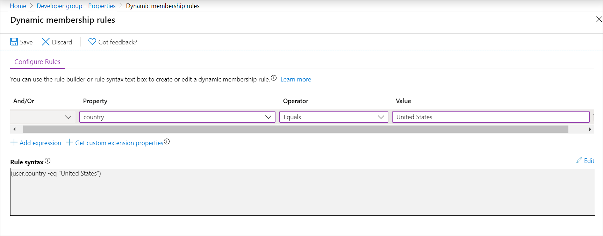
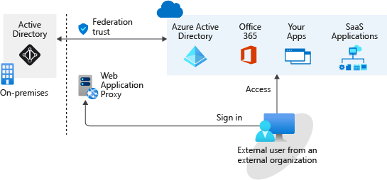
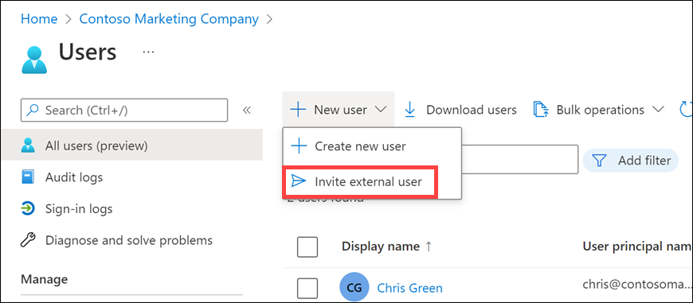
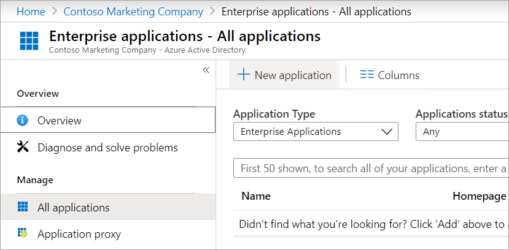
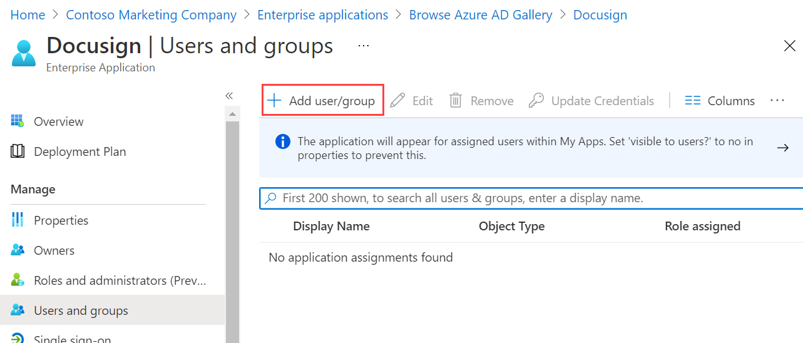
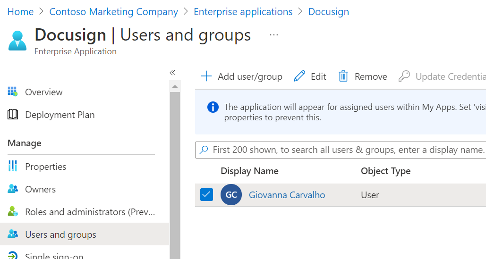
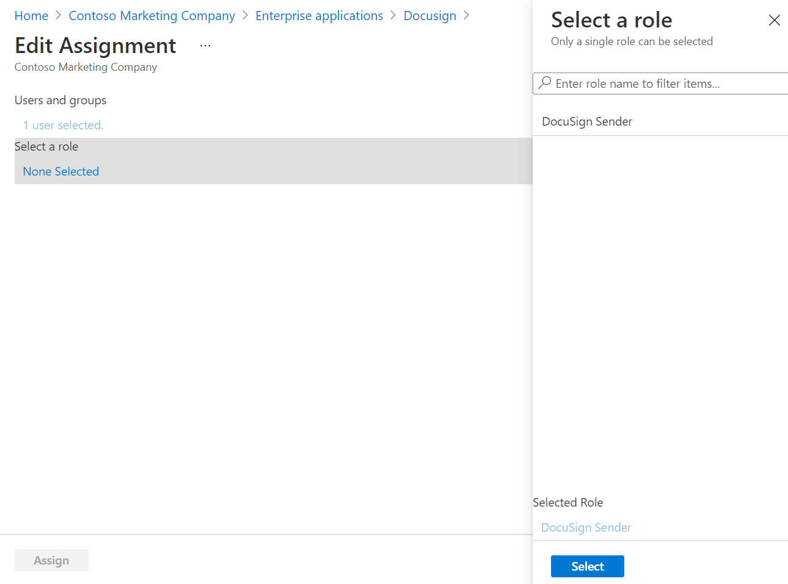
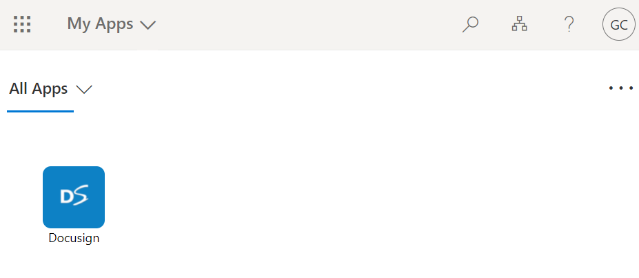
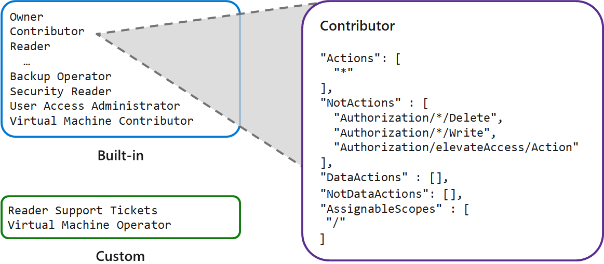

# Manage Azure identities and governance (15–20%)

## Configure Microsoft Entra ID

## Configure user and group accounts

## Configure subscriptions

## Configure Azure Policy

## Configure role-based access control

## Create Azure users and groups in Microsoft Entra ID

### What are user accounts in Microsoft Entra ID?

* **Administrator roles** : Allow users elevated access to control who is allowed to do what. You assign these roles to a limited group of users to manage identity tasks in a Microsoft Entra organization. You can assign administrator roles that allow a user to create or edit users, assign administrative roles to others, reset user passwords, manage user licenses, and more.
* **Member users** : A member user account is a native member of the Microsoft Entra organization that has a set of default permissions like being able to manage their profile information. When someone new joins your organization, they typically have this type of account created for them.
* **Guest users** : Guest users have restricted Microsoft Entra organization permissions. When you invite someone to collaborate with your organization, you add them to your Microsoft Entra organization as a guest user. Then, you can either send an invitation email that contains a redemption link or send a direct link to an app you want to share. Guest users sign in with their own work, school, or social identities. By default, Microsoft Entra member users can invite guest users. Someone with the User Administrator role can disable this default.

```powershell
# create a new user
az ad user create

# create a new user
New-MgUser

$invitations = import-csv c:\bulkinvite\invitations.csv

$messageInfo = [Microsoft.Graph.PowerShell.Models.MicrosoftGraphInvitation]@{ CustomizedMessageBody = "Hello. You are invited to the Contoso organization." }

foreach ($email in $invitations)
   {New-MgInvitation -InviteRedirectUrl https://myapps.microsoft.com -InvitedUserDisplayName $email.Name -InvitedUserEmailAddress $email.InvitedUserEmailAddress -InvitedUserMessageInfo $messageInfo -SendInvitationMessage 
   }

# delete a user
Remove-MgUser

# delete a user
az ad user delete
```

* When you delete a user, the account remains in a suspended state for 30 days. During that 30-day window, the user account can be restored.

### Exercise - Add and delete users in Microsoft Entra ID

### Manage app and resource access by using Microsoft Entra groups

#### Access management in Microsoft Entra ID

* Microsoft Entra roles: Use Microsoft Entra roles to manage Microsoft Entra ID-related resources like users, groups, billing, licensing, application registration, and more.
* Role-based access control (RBAC) for Azure resources: Use RBAC roles to manage access to Azure resources like virtual machines, SQL databases, or storage. For example, you could assign an RBAC role to a user to manage and delete SQL databases in a specific resource group or subscription.

#### Access rights through single user or group assignment

* **Direct assignment**: Assign a user the required access rights by directly assigning a role that has those access rights.
* **Group assignment**: Assign a group the required access rights, and members of the group will inherit those rights.
* **Rule-based assignment**: Use rules to determine a group membership based on user or device properties. For a user account or device's group membership to be valid, the user or device must meet the rules. If the rules aren't met, the user account or device's group membership is no longer valid. The rules can be simple. You can select prewritten rules or write your own advanced rules.

### Exercise - Assign users to Microsoft Entra groups

#### Modify the group to use dynamic assignment



### Collaborate by using guest accounts and Microsoft Entra B2B

* With Microsoft Entra business to business (B2B), you can add people from other companies to your Microsoft Entra tenant as guest users.

* If your organization has multiple Microsoft Entra tenants, you may also want to use Microsoft Entra B2B to give a user in tenant A access to resources in tenant B. Each Microsoft Entra tenant is distinct and separate from other Microsoft Entra tenants and has its own representation of identities and app registrations.

#### Why use Microsoft Entra B2B instead of federation?

With Microsoft Entra B2B, you don't take on the responsibility of managing and authenticating the credentials and identities of partners. Your partners can collaborate with you even if they don't have an IT department. For example, you can collaborate with a contractor who only has a personal or business email address and no identity management solution managed by an IT department.

Giving access to external users is much easier than in a federation. You don't need an AD administrator to create and manage external user accounts. Any authorized user can invite other users. A line manager could, for example, invite external users to collaborate with their team. When collaboration is no longer needed, you can easily remove these external users.

A federation is more complex. A federation is where you have a trust established with another organization, or a collection of domains, for shared access to a set of resources. You might be using an on-premises identity provider and authorization service like Active Directory Federation Services (AD FS) that has an established trust with Microsoft Entra ID. To get access to resources, all users have to provide their credentials and successfully authenticate against the AD FS server. If you have someone trying to authenticate outside the internal network, you need to set up a web application proxy. The architecture might look something like the following diagram:



### Exercise - Give guest users access in Microsoft Entra B2B

#### Add guest users to the organization



#### Add guest users to an application











## Configure role-based access control

### Implement role-based access control

#### Things to know about Azure RBAC

* Allow an application to access all resources in a resource group.
* Allow one user to manage VMs in a subscription, and allow another user to manage virtual networks.
* Allow a database administrator (DBA) group to manage SQL databases in a subscription.
* Allow a user to manage all resources in a resource group, such as VMs, websites, and subnets.

#### Azure RBAC concepts

| Concept            | Description                                                                                           | Examples                                                                                                                                                      |
|--------------------|-------------------------------------------------------------------------------------------------------|---------------------------------------------------------------------------------------------------------------------------------------------------------------|
| Security Principal| An object that represents something that requests access to resources.                                | User, group, service principal, managed identity                                                                                                             |
| Role Definition   | A set of permissions that lists the allowed operations. Azure RBAC comes with built-in role definitions, but you can also create your own custom role definitions. | Some built-in role definitions: Reader, Contributor, Owner, User Access Administrator                                                                        |
| Scope             | The boundary for the requested level of access, or "how much" access is granted.                      | Management group, subscription, resource group, resource                                                                                                      |
| Role Assignment   | An assignment attaches a role definition to a security principal at a particular scope. Users can grant the access described in a role definition by creating (attaching) an assignment for the role. | - Assign the User Access Administrator role to an admin group scoped to a management group - Assign the Contributor role to a user scoped to a subscription |

### Things to consider when using Azure RBAC

As you think about how you can implement roles and scope assignments within your organization, consider these points:

* **Consider your requestors**: Plan your strategy to accommodate for all types of access to your resources. Security principals are created for anything that requests access to your resources. Determine who are the requestors in your organization. Requestors can be internal or external users, groups of users, applications and services, resources, and so on.

* **Consider your roles**: Examine the types of job responsibilities and work scenarios in your organization. Roles are commonly built around the requirements to fulfill job tasks or complete work goals. Certain users like administrators, corporate controllers, and engineers can require a level of access beyond what most users need. Some roles can be defined to provide the same access for all members of a team or department for specific resources or applications.

* **Consider scope of permissions**: Think about how you can ensure security by controlling the scope of permissions for role assignments. Outline the types of permissions and levels of scope that you need to support. You can apply different scope levels for a single role to support requestors in different scenarios.

* **Consider built-in or custom definitions**: Review the built-in role definitions in Azure RBAC. Built-in roles can be used as-is, or adjusted to meet the specific requirements for your organization. You can also create custom role definitions from scratch.

### Create a role definition



#### Things to know about role definitions

* Azure RBAC provides built-in roles and permissions sets. You can also create custom roles and permissions.

* The Owner built-in role has the highest level of access privilege in Azure.

* The system subtracts NotActions permissions from Actions permissions to determine the effective permissions for a role.

* The AssignableScopes permissions for a role can be management groups, subscriptions, resource groups, or resources.

#### Role permissions

| Role name   | Description                                     | Actions permissions   | NotActions permissions                                               |
|-------------|-------------------------------------------------|-----------------------|-----------------------------------------------------------------------|
| Owner       | Allow all actions                              | *                     | n/a                                                                   |
| Contributor | Allow all actions, except write or delete role assignment | *          | - Microsoft.Authorization/*/Delete <br> - Microsoft.Authorization/*/Write <br> - Microsoft.Authorization/elevateAccess/Action |
| Reader      | Allow all read actions                         | /*/read               | n/a                                                                   |

## Configure storage accounts

### Implement Azure Storage

#### Things to know about Azure Storage

| Category            | Description                                                                                                  | Storage Examples                                                                                                                                               |
|---------------------|--------------------------------------------------------------------------------------------------------------|----------------------------------------------------------------------------------------------------------------------------------------------------------------|
| Virtual machine data | Virtual machine data storage includes disks and files. Disks are persistent block storage for Azure IaaS virtual machines. Files are fully managed file shares in the cloud. | Storage for virtual machine data is provided through Azure managed disks. Data disks are used by virtual machines to store data like database files, website static content, or custom application code. The number of data disks you can add depends on the virtual machine size. Each data disk has a maximum capacity of 32,767 GB. |
| Unstructured data   | Unstructured data is the least organized. Unstructured data may not have a clear relationship. The format of unstructured data is referred to as nonrelational.           | Unstructured data can be stored by using Azure Blob Storage and Azure Data Lake Storage. Blob Storage is a highly scalable, REST-based cloud object store. Azure Data Lake Storage is the Hadoop Distributed File System (HDFS) as a service. |
| Structured data     | Structured data is stored in a relational format that has a shared schema. Structured data is often contained in a database table with rows, columns, and keys. Tables are an autoscaling NoSQL store. |  |

#### Things to consider when using Azure Storage
* Consider durability and availability. Azure Storage is durable and highly available. Redundancy ensures your data is safe during transient hardware failures. You replicate data across datacenters or geographical regions for protection from local catastrophe or natural disaster. Replicated data remains highly available during an unexpected outage.

* Consider secure access. Azure Storage encrypts all data. Azure Storage provides you with fine-grained control over who has access to your data.

* Consider scalability. Azure Storage is designed to be massively scalable to meet the data storage and performance needs of modern applications.

* Consider manageability. Microsoft Azure handles hardware maintenance, updates, and critical issues for you.

* Consider data accessibility. Data in Azure Storage is accessible from anywhere in the world over HTTP or HTTPS. Microsoft provides SDKs for Azure Storage in various languages. You can use .NET, Java, Node.js, Python, PHP, Ruby, Go, and the REST API. Azure Storage supports scripting in Azure PowerShell or the Azure CLI. The Azure portal and Azure Storage Explorer offer easy visual solutions for working with your data.

### Explore Azure Storage services

Azure Blob Storage (containers): A massively scalable object store for text and binary data.

Azure Files: Managed file shares for cloud or on-premises deployments.

Azure Queue Storage: A messaging store for reliable messaging between application components.

Azure Table Storage: A service that stores nonrelational structured data (also known as structured NoSQL data).

### Determine storage account types

### Determine replication strategies

We explore four replication strategies:

* Locally redundant storage (LRS)
* Zone redundant storage (ZRS)
* Geo-redundant storage (GRS)
* Geo-zone-redundant storage (GZRS)

#### Things to consider when choosing replication strategies

| Event                     | LRS        | ZRS        | GRS        | RA-GRS     | GZRS       | RA-GZRS    |
|---------------------------|------------|------------|------------|------------|------------|------------|
| Node in data center unavailable |            |            |            |            |            |            |
| Entire data center unavailable |            |            |            |            |            |            |
| Region-wide outage        |            |            |            |            |            |            |
| Read access during region-wide outage |            | ZRS        | GRS        | RA-GRS     | GZRS       | RA-GZRS    |


### Access storage

* Every object you store in Azure Storage has a unique URL address. Your storage account name forms the subdomain portion of the URL address. The combination of the subdomain and the domain name, which is specific to each service, forms an endpoint for your storage account.

* To access the myblob data in the mycontainer location in your storage account, we use the following URL address:

//mystorageaccount.blob.core.windows.net/mycontainer/myblob.

| Service           | Default endpoint                                 |
|-------------------|--------------------------------------------------|
| Container service | //mystorageaccount.blob.core.windows.net         |
| Table service     | //mystorageaccount.table.core.windows.net        |
| Queue service     | //mystorageaccount.queue.core.windows.net        |
| File service      | //mystorageaccount.file.core.windows.net         |

#### Configure custom domains

* You can configure a custom domain to access blob data in your Azure storage account. As we reviewed, the default endpoint for Azure Blob Storage is \<storage-account-name>.blob.core.windows.net. If you map a custom domain and subdomain, such as www.contoso.com, to the blob or web endpoint for your storage account, your users can use that domain to access blob data in your storage account.
* There are two ways to configure a custom domain: 
   * Direct mapping
   * Intermediary domain mapping.

### Secure storage endpoints

#### Things to know about configuring service endpoints
Here are some points to consider about configuring service access settings:

* The Firewalls and virtual networks settings restrict access to your storage account from specific subnets on virtual networks or public IPs.

* You can configure the service to allow access to one or more public IP ranges.

* Subnets and virtual networks must exist in the same Azure region or region pair as your storage account.

## Configure Azure Blob Storage 

