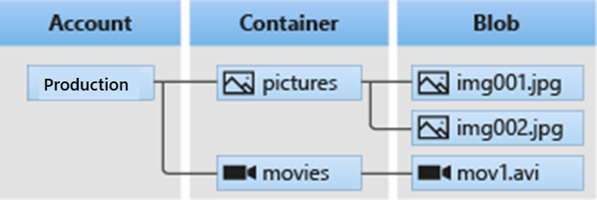

# Implement and manage storage

***

## Configure storage accounts

### Implement Azure Storage

#### Things to know about Azure Storage

| Category             | Description                                                                                                                                                                                            | Storage Examples                                                                                                                                                                                                                                                                                                                       |
| -------------------- | ------------------------------------------------------------------------------------------------------------------------------------------------------------------------------------------------------ | -------------------------------------------------------------------------------------------------------------------------------------------------------------------------------------------------------------------------------------------------------------------------------------------------------------------------------------- |
| Virtual machine data | Virtual machine data storage includes disks and files. Disks are persistent block storage for Azure IaaS virtual machines. Files are fully managed file shares in the cloud.                           | Storage for virtual machine data is provided through Azure managed disks. Data disks are used by virtual machines to store data like database files, website static content, or custom application code. The number of data disks you can add depends on the virtual machine size. Each data disk has a maximum capacity of 32,767 GB. |
| Unstructured data    | Unstructured data is the least organized. Unstructured data may not have a clear relationship. The format of unstructured data is referred to as nonrelational.                                        | Unstructured data can be stored by using Azure Blob Storage and Azure Data Lake Storage. Blob Storage is a highly scalable, REST-based cloud object store. Azure Data Lake Storage is the Hadoop Distributed File System (HDFS) as a service.                                                                                          |
| Structured data      | Structured data is stored in a relational format that has a shared schema. Structured data is often contained in a database table with rows, columns, and keys. Tables are an autoscaling NoSQL store. |                                                                                                                                                                                                                                                                                                                                        |

#### Things to consider when using Azure Storage

* Consider durability and availability. Azure Storage is durable and highly available. Redundancy ensures your data is safe during transient hardware failures. You replicate data across datacenters or geographical regions for protection from local catastrophe or natural disaster. Replicated data remains highly available during an unexpected outage.
* Consider secure access. Azure Storage encrypts all data. Azure Storage provides you with fine-grained control over who has access to your data.
* Consider scalability. Azure Storage is designed to be massively scalable to meet the data storage and performance needs of modern applications.
* Consider manageability. Microsoft Azure handles hardware maintenance, updates, and critical issues for you.
* Consider data accessibility. Data in Azure Storage is accessible from anywhere in the world over HTTP or HTTPS. Microsoft provides SDKs for Azure Storage in various languages. You can use .NET, Java, Node.js, Python, PHP, Ruby, Go, and the REST API. Azure Storage supports scripting in Azure PowerShell or the Azure CLI. The Azure portal and Azure Storage Explorer offer easy visual solutions for working with your data.

### Explore Azure Storage services

Azure Blob Storage (containers): A massively scalable object store for text and binary data.

Azure Files: Managed file shares for cloud or on-premises deployments.

Azure Queue Storage: A messaging store for reliable messaging between application components.

Azure Table Storage: A service that stores nonrelational structured data (also known as structured NoSQL data).

### Determine storage account types

### Determine replication strategies

We explore four replication strategies:

* Locally redundant storage (LRS)
* Zone redundant storage (ZRS)
* Geo-redundant storage (GRS)
* Geo-zone-redundant storage (GZRS)

#### Things to consider when choosing replication strategies

| Event                                 | LRS | ZRS | GRS | RA-GRS | GZRS | RA-GZRS |
| ------------------------------------- | --- | --- | --- | ------ | ---- | ------- |
| Node in data center unavailable       |     |     |     |        |      |         |
| Entire data center unavailable        |     |     |     |        |      |         |
| Region-wide outage                    |     |     |     |        |      |         |
| Read access during region-wide outage |     | ZRS | GRS | RA-GRS | GZRS | RA-GZRS |

### Access storage

* Every object you store in Azure Storage has a unique URL address. Your storage account name forms the subdomain portion of the URL address. The combination of the subdomain and the domain name, which is specific to each service, forms an endpoint for your storage account.
* To access the myblob data in the mycontainer location in your storage account, we use the following URL address:

//mystorageaccount.blob.core.windows.net/mycontainer/myblob.

| Service           | Default endpoint                          |
| ----------------- | ----------------------------------------- |
| Container service | //mystorageaccount.blob.core.windows.net  |
| Table service     | //mystorageaccount.table.core.windows.net |
| Queue service     | //mystorageaccount.queue.core.windows.net |
| File service      | //mystorageaccount.file.core.windows.net  |

#### Configure custom domains

* You can configure a custom domain to access blob data in your Azure storage account. As we reviewed, the default endpoint for Azure Blob Storage is \<storage-account-name>.blob.core.windows.net. If you map a custom domain and subdomain, such as www.contoso.com, to the blob or web endpoint for your storage account, your users can use that domain to access blob data in your storage account.
* There are two ways to configure a custom domain:
  * Direct mapping
  * Intermediary domain mapping.

### Secure storage endpoints

#### Things to know about configuring service endpoints

Here are some points to consider about configuring service access settings:

* The Firewalls and virtual networks settings restrict access to your storage account from specific subnets on virtual networks or public IPs.
* You can configure the service to allow access to one or more public IP ranges.
* Subnets and virtual networks must exist in the same Azure region or region pair as your storage account.

***

## Configure Azure Blob Storage

### Implement Azure Blog Storage

#### Things to know about Azure Blob Storage 

* Blob Storage uses three resources to store and manage your data:
  * An Azure storage account
  * Containers in an Azure storage account
  * Blobs in a container
* To implement Blob Storage, you configure several settings:
  * Blob container options
  * Blob types and upload options
  * Blob Storage access tiers
  * Blob lifecycle rules
  * Blob object replication options

<figure><figcaption></figcaption></figure>

#### Things to consider when implementing Azure Blob Storage 

* **Consider browser uploads**. Use Blob Storage to serve images or documents directly to a browser.
* **Consider distributed access**. Blob Storage can store files for distributed access, such as during an installation process.
* **Consider streaming data**. Stream video and audio by using Blob Storage.
* **Consider archiving and recovery**. Blob Storage is a great solution for storing data for backup and restore, disaster recovery, and archiving.
* **Consider application access**. You can store data in Blob Storage for analysis by an on-premises or Azure-hosted service.

### Create blob containers

#### Configure a container 

* **Name**: Enter a name for your container. The name must be unique within the Azure storage account.
  * The name can contain only lowercase letters, numbers, and hyphens.
  * The name must begin with a letter or a number.
  * The minimum length for the name is three characters.
  * The maximum length for the name is 63 characters.
* **Public access level**: The access level specifies whether the container and its blobs can be accessed publicly. By default, container data is private and visible only to the account owner. There are three access level choices:
  * **Private**: (Default) Prohibit anonymous access to the container and blobs.
  * **Blob**: Allow anonymous public read access for the blobs only.
  * **Container**: Allow anonymous public read and list access to the entire container, including the blobs.

### Assign blob access tiers

#### Things to know about blob access tiers 

**Hot tier**

The Hot tier is optimized for frequent reads and writes of objects in the Azure storage account. A good usage case is data that is actively being processed. By default, new storage accounts are created in the Hot tier. This tier has the lowest access costs, but higher storage costs than the Cool and Archive tiers.

**Cool tier**

The Cool tier is optimized for storing large amounts of data that's infrequently accessed. This tier is intended for data that remains in the Cool tier for at least 30 days. A usage case for the Cool tier is short-term backup and disaster recovery datasets and older media content. This content shouldn't be viewed frequently, but it needs to be immediately available. Storing data in the Cool tier is more cost-effective. Accessing data in the Cool tier can be more expensive than accessing data in the Hot tier.

**Cold tier**

The Cold tier is also optimized for storing large amounts of data that's infrequently accessed. This tier is intended for data that can remain in the tier for at least 90 days.

**Archive tier**

The Archive tier is an offline tier that's optimized for data that can tolerate several hours of retrieval latency. Data must remain in the Archive tier for at least 180 days or be subject to an early deletion charge. Data for the Archive tier includes secondary backups, original raw data, and legally required compliance information. This tier is the most cost-effective option for storing data. Accessing data is more expensive in the Archive tier than accessing data in the other tiers.

#### Compare access tiers 

| Comparison                       | Hot access tier | Cool access tier | Cold access tier | Archive access tier |
| -------------------------------- | --------------- | ---------------- | ---------------- | ------------------- |
| **Availability**                 | 99.9%           | 99%              | 99%              | 99%                 |
| **Availability (RA-GRS reads)**  | 99.99%          | 99.9%            | 99.9%            | 99.9%               |
| **Latency (time to first byte)** | milliseconds    | milliseconds     | milliseconds     | hours               |
| **Minimum storage duration**     | N/A             | 30 days          | 90 days          | 180 days            |

### Add blob lifecycle management rules

#### Things to know about lifecycle management 

Consider a scenario where data is frequently accessed in the early stages of the lifecycle, but only occasionally after two weeks. After the first month, the data set is rarely accessed. In this scenario, the Hot tier of Blob Storage is best during the early stages. Cool tier storage is most appropriate for occasional access. Archive tier storage is the best option after the data ages over a month. To achieve this transition, lifecycle management policy rules are available to move aging data to cooler tiers.

### Determine blog object replication

<figure><figcaption></figcaption></figure>

#### Things to know about blob object replication 

* Object replication is supported when the source and destination accounts are in the Hot, Cool, or Cold tier. The source and destination accounts can be in different tiers.

#### Things to consider when configuring blob object replication

* **Consider latency reductions**. Minimize latency with blob object replication. You can reduce latency for read requests by enabling clients to consume data from a region that's in closer physical proximity.
* **Consider efficiency for compute workloads**. Improve efficiency for compute workloads by using blob object replication. With object replication, compute workloads can process the same sets of blobs in different regions.
* **Consider data distribution**. Optimize your configuration for data distribution. You can process or analyze data in a single location and then replicate only the results to other regions.
* **Consider costs benefits**. Manage your configuration and optimize your storage policies to achieve cost benefits. After your data is replicated, you can reduce costs by moving the data to the Archive tier by using lifecycle management policies.

### Upload blobs

* **Block blobs**. A block blob consists of blocks of data that are assembled to make a blob. Most Blob Storage scenarios use block blobs. Block blobs are ideal for storing text and binary data in the cloud, like files, images, and videos.
* **Append blobs**. An append blob is similar to a block blob because the append blob also consists of blocks of data. The blocks of data in an append blob are optimized for _append_ operations. Append blobs are useful for logging scenarios, where the amount of data can increase as the logging operation continues.
* **Page blobs**. A page blob can be up to 8 TB in size. Page blobs are more efficient for frequent read/write operations. **Azure Virtual Machines uses page blobs for operating system disks and data disks.**
* The block blob type is the default type for a new blob. When you're creating a new blob, if you don't choose a specific type, the new blob is created as a block blob.
* After you create a blob, you can't change its type.

#### Things to consider when using blob upload tools 

| Upload tool             | Description                                                                                                                                                                                                                                                                                                                                       |
| ----------------------- | ------------------------------------------------------------------------------------------------------------------------------------------------------------------------------------------------------------------------------------------------------------------------------------------------------------------------------------------------- |
| **AzCopy**              | An easy-to-use command-line tool for Windows and Linux. You can copy data to and from Blob Storage, across containers, and across storage accounts.                                                                                                                                                                                               |
| **Azure Data Box Disk** | A service for transferring on-premises data to Blob Storage when large datasets or network constraints make uploading data over the wire unrealistic. You can use Azure Data Box Disk to request solid-state disks (SSDs) from Microsoft. You can copy your data to those disks and ship them back to Microsoft to be uploaded into Blob Storage. |
| **Azure Import/Export** | A service that helps you export large amounts of data from your storage account to hard drives that you provide and that Microsoft then ships back to you with your data.                                                                                                                                                                         |

### Determine Blob Storage pricing

### Interactive lab simulation

